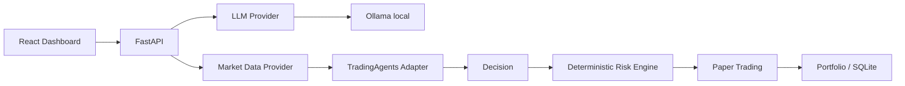

# AI Trading Platform — Arquitetura

## 1. TradingAgents analisado

O projeto original usa LangGraph para orquestrar agentes especializados: Fundamentals, Sentiment, News e Technical Analysts alimentam Bull/Bear Researchers; o Trader consolida a decisão e o time de Risk Management/Portfolio Manager avalia a proposta. A API Python expõe `TradingAgentsGraph().propagate(ticker, date)`, e o CLI permite escolher ticker, data, provider, modelo e profundidade. O framework suporta OpenAI, Google, Anthropic, xAI, DeepSeek, Qwen, GLM, MiniMax, OpenRouter, Ollama e endpoints OpenAI-compatible. Ollama usa `http://localhost:11434/v1` por padrão. O projeto tem memória de decisões e checkpoints SQLite.

Fonte: https://github.com/TauricResearch/TradingAgents

## 2. Reuso e isolamento

- Reutilizar futuramente `TradingAgentsGraph`, `DEFAULT_CONFIG` e seus contratos de decisão via `tradingagents/adapter.py`.
- Não copiar nem modificar o core upstream.
- Encapsular providers externos atrás de interfaces locais (`LLMProvider`, depois `MarketDataProvider` e `NewsProvider`).
- Risk Engine, portfolio e paper trading serão determinísticos e independentes da LLM.

## 3. Nova arquitetura



## 4. Estrutura

```text
backend/app/{api,llm,agents,trading,risk,portfolio,market_data,database}
frontend/{src,public}
tradingagents/                 # adapter, sem vendorizar o upstream
tests/
```

## 5. Fluxo futuro

`Market Data -> deterministic indicators -> TradingAgents analysts -> Bull/Bear -> Trader -> Risk Engine -> Paper Trading -> Portfolio`.

## 6. Dependências

Fase 1: Python 3.12+, FastAPI, Uvicorn, Pydantic Settings, httpx e pytest; frontend React/TypeScript/Vite/Tailwind na próxima iteração de UI. SQLite é o default e `DATABASE_URL` permite PostgreSQL futuramente.

## 7. Riscos técnicos

- Dados de mercado e notícias podem ter atraso, cobertura desigual e custo.
- LLMs são não determinísticas; decisões precisam de snapshot, logs e métricas.
- Backtests exigem point-in-time data para evitar look-ahead bias.
- TradingAgents pode evoluir sua API; o adapter reduz acoplamento.
- Nenhuma ordem real é permitida nesta versão.

## 8. Roadmap

1. Fase 1: shell, Ollama, health checks e UI.
2. Fase 2: adapter TradingAgents e pipeline visual.
3. Fases 3–7: paper trading, dados/gráficos, backtest, Arena e calibração.

## 9. Decisões

- Ollama é o provider padrão e não exige API paga.
- `TRADING_MODE` só aceita `PAPER`.
- Cálculos financeiros e risco nunca dependem exclusivamente de LLM.
- Frontend não recebe secrets; o backend controla providers.
